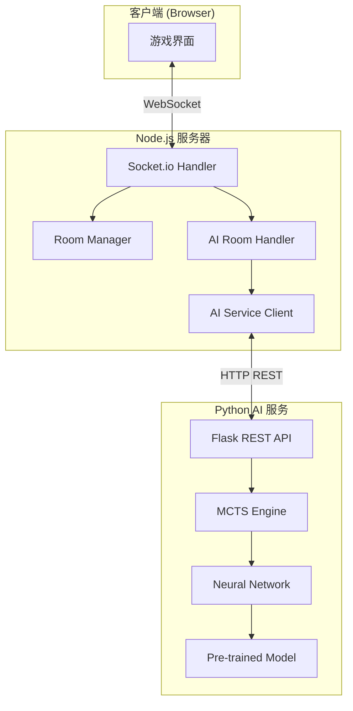

# Design Document: AI vs Human Mode

## Overview

本设计文档描述如何将 AlphaZero 五子棋 AI 集成到现有的在线五子棋游戏中，实现人机对战模式。

系统采用微服务架构：
- **Node.js 游戏服务器**：处理客户端连接、游戏逻辑、房间管理
- **Python AI 服务**：运行 AlphaZero 模型，提供 AI 落子计算

两个服务通过 HTTP REST API 通信，AI 服务作为独立进程运行。

## Architecture



## Components and Interfaces

### 1. AI Service (Python Flask)

**文件**: `ai-service/app.py`

```python
# AI 服务 REST API 接口
class AIServiceAPI:
    """
    Flask REST API 服务，提供 AI 落子计算
    """
    
    def health_check() -> dict:
        """
        GET /health
        返回服务状态和模型信息
        Response: {"status": "ok", "model": "alphazero-15x15", "version": "1.0"}
        """
        pass
    
    def get_move(board_state: dict) -> dict:
        """
        POST /move
        计算 AI 落子位置
        
        Request Body:
        {
            "board": [[0,0,...], ...],  # 15x15 棋盘，0=空，1=黑，-1=白
            "currentPlayer": 1 | -1,     # 当前玩家（AI 执棋颜色）
            "difficulty": "easy" | "medium" | "hard"
        }
        
        Response:
        {
            "x": number,  # 0-14
            "y": number   # 0-14
        }
        """
        pass
```

### 2. AI Service Client (Node.js)

**文件**: `src/aiServiceClient.js`

```javascript
class AIServiceClient {
    constructor(baseUrl = 'http://localhost:5001') {}
    
    /**
     * 检查 AI 服务是否可用
     * @returns {Promise<{available: boolean, info?: object}>}
     */
    async checkHealth() {}
    
    /**
     * 请求 AI 落子
     * @param {number[][]} board - 棋盘状态 (15x15)
     * @param {number} currentPlayer - 当前玩家 (1=黑, 2=白)
     * @param {string} difficulty - 难度 ('easy'|'medium'|'hard')
     * @returns {Promise<{x: number, y: number}>}
     */
    async getMove(board, currentPlayer, difficulty) {}
    
    /**
     * 转换棋盘格式：项目格式 -> AI 服务格式
     * 项目: 0=空, 1=黑, 2=白
     * AI服务: 0=空, 1=黑(先手), -1=白(后手)
     */
    convertBoardForAI(board, aiColor) {}
}
```

### 3. AI Room Handler (Node.js)

**文件**: `src/aiRoomHandler.js`

```javascript
class AIRoomHandler {
    constructor(roomManager, aiClient) {}
    
    /**
     * 创建 AI 对战房间
     * @param {object} player - 玩家信息 {socketId, nickname}
     * @param {string} difficulty - 难度
     * @param {boolean} playerFirst - 玩家是否先手
     * @returns {AIRoom}
     */
    createAIRoom(player, difficulty, playerFirst) {}
    
    /**
     * 处理玩家落子后的 AI 响应
     * @param {string} roomId - 房间ID
     * @returns {Promise<{x: number, y: number}|null>}
     */
    async handlePlayerMove(roomId) {}
    
    /**
     * 执行 AI 悔棋（撤销两步）
     * @param {string} roomId - 房间ID
     * @returns {{success: boolean, error?: string}}
     */
    executeAIUndo(roomId) {}
    
    /**
     * 重置 AI 房间（再来一局）
     * @param {string} roomId - 房间ID
     */
    resetAIRoom(roomId) {}
}
```

### 4. AI Room Data Structure

```javascript
/**
 * AI 房间数据结构（扩展自普通房间）
 */
const AIRoom = {
    id: 'ai-xxx',           // 房间ID，以 'ai-' 前缀标识
    name: 'AI对战',
    isAIRoom: true,         // 标识为 AI 房间
    
    // 玩家信息
    players: {
        black: { socketId, nickname } | { isAI: true, nickname: 'AI' },
        white: { socketId, nickname } | { isAI: true, nickname: 'AI' }
    },
    
    // AI 配置
    aiConfig: {
        difficulty: 'easy' | 'medium' | 'hard',
        aiColor: 1 | 2,     // AI 执棋颜色
        playerColor: 1 | 2  // 玩家执棋颜色
    },
    
    // 游戏状态
    board: [[...]],         // 15x15 棋盘
    currentTurn: 1 | 2,     // 当前回合
    history: [],            // 落子历史
    status: 'playing' | 'ended',
    winner: null | 1 | 2,
    
    // AI 房间特有
    undoCount: 0,           // 已悔棋次数
    maxUndo: 3,             // 最大悔棋次数
    aiThinking: false,      // AI 是否正在思考
    
    // 不允许观战
    watchers: [],           // 始终为空
    
    // 时间戳
    createdAt: Date,
    lastActivity: Date
};
```

## Data Models

### Board State Conversion

项目内部和 AI 服务使用不同的棋盘表示：

| 状态 | 项目内部 | AI 服务 |
|------|---------|---------|
| 空位 | 0 | 0 |
| 黑棋 | 1 | 1 |
| 白棋 | 2 | -1 |

转换逻辑：
```javascript
// 项目 -> AI 服务
function toAIFormat(board) {
    return board.map(row => 
        row.map(cell => cell === 2 ? -1 : cell)
    );
}

// AI 服务 -> 项目
function fromAIFormat(board) {
    return board.map(row => 
        row.map(cell => cell === -1 ? 2 : cell)
    );
}
```

### Difficulty Configuration

| 难度 | MCTS 模拟次数 | 预计响应时间 |
|------|--------------|-------------|
| 简单 (easy) | 100 | < 1秒 |
| 中等 (medium) | 400 | 2-3秒 |
| 困难 (hard) | 800 | 5-8秒 |

## Correctness Properties

*A property is a characteristic or behavior that should hold true across all valid executions of a system-essentially, a formal statement about what the system should do. Properties serve as the bridge between human-readable specifications and machine-verifiable correctness guarantees.*

### Property 1: AI Room Creation Assigns AI Opponent
*For any* AI room creation request with valid player info and difficulty, the created room should have exactly one human player and one AI player assigned.

**Validates: Requirements 1.1, 1.2**

### Property 2: AI Rooms Hidden from Public List
*For any* room list query, AI rooms (rooms with isAIRoom === true) should never appear in the returned list.

**Validates: Requirements 1.4**

### Property 3: Difficulty Configuration Stored Correctly
*For any* AI room created with a specific difficulty ('easy', 'medium', 'hard'), the room's aiConfig.difficulty should match the requested difficulty.

**Validates: Requirements 2.5**

### Property 4: AI Move Validity
*For any* board state sent to the AI service, the returned move (x, y) should always be a valid empty position on the board (0 ≤ x, y < 15 and board[x][y] === 0).

**Validates: Requirements 3.4**

### Property 5: Board State Conversion Round-Trip
*For any* valid board state in project format, converting to AI format and back should produce an equivalent board state.

**Validates: Requirements 3.5**

### Property 6: Player Move Triggers AI Response
*For any* AI room in playing state where it's the player's turn, after a valid player move, the system should request an AI move and update the board with the AI's response.

**Validates: Requirements 4.1, 4.2**

### Property 7: Win Detection Consistency
*For any* AI room, the win detection logic should produce the same result as regular rooms for identical board states.

**Validates: Requirements 4.6**

### Property 8: AI First Move When Player Second
*For any* AI room where the player chose to play second (white), the AI should automatically make the first move before the player's turn.

**Validates: Requirements 5.2**

### Property 9: AI Room Destroyed on Leave
*For any* AI room, when the human player leaves, the room should be immediately destroyed and removed from the room manager.

**Validates: Requirements 7.1**

### Property 10: AI Room Join Rejection
*For any* AI room, any attempt by another player to join (as player or watcher) should be rejected.

**Validates: Requirements 7.2, 7.4**

### Property 11: AI Room Rematch Swaps Colors
*For any* AI room rematch request, the board should be reset to empty and the player/AI colors should be swapped.

**Validates: Requirements 7.3**

### Property 12: AI Undo Removes Two Moves
*For any* AI room with at least 2 moves in history, executing undo should remove exactly 2 moves (player's move and AI's response), and the board state should match the state before those moves.

**Validates: Requirements 8.1, 8.4**

### Property 13: Undo Count Limit Enforced
*For any* AI room, the undo count should never exceed 3, and undo requests beyond this limit should be rejected with an appropriate error.

**Validates: Requirements 8.2**

## Error Handling

### AI Service Unavailable

```javascript
// 启动时检查
async function checkAIServiceOnStartup() {
    const result = await aiClient.checkHealth();
    if (!result.available) {
        console.warn('[AI] AI 服务不可用，人机对战功能已禁用');
        aiServiceAvailable = false;
    }
}

// 客户端通知
socket.emit('ai-service-status', { available: aiServiceAvailable });
```

### AI Move Timeout

```javascript
async function getAIMoveWithRetry(board, player, difficulty) {
    const TIMEOUT = 10000; // 10秒
    
    try {
        return await Promise.race([
            aiClient.getMove(board, player, difficulty),
            new Promise((_, reject) => 
                setTimeout(() => reject(new Error('timeout')), TIMEOUT)
            )
        ]);
    } catch (error) {
        if (error.message === 'timeout') {
            // 重试一次
            try {
                return await Promise.race([
                    aiClient.getMove(board, player, difficulty),
                    new Promise((_, reject) => 
                        setTimeout(() => reject(new Error('timeout')), TIMEOUT)
                    )
                ]);
            } catch {
                // 回退到随机落子
                return getRandomValidMove(board);
            }
        }
        throw error;
    }
}
```

## Testing Strategy

### Unit Tests

1. **Board Conversion Tests**
   - 测试项目格式到 AI 格式的转换
   - 测试 AI 格式到项目格式的转换
   - 测试空棋盘、满棋盘、部分填充棋盘

2. **AI Room Handler Tests**
   - 测试 AI 房间创建
   - 测试悔棋逻辑（边界情况）
   - 测试房间重置

3. **AI Service Client Tests**
   - 测试健康检查
   - 测试超时处理
   - 测试重试逻辑

### Property-Based Tests

使用 fast-check 进行属性测试：

1. **Board Conversion Round-Trip** (Property 2)
   - 生成随机棋盘状态
   - 验证转换往返一致性

2. **AI Move Validity** (Property 1)
   - 生成随机棋盘状态
   - 验证 AI 返回的落子位置有效

3. **Undo Operation** (Property 5)
   - 生成随机游戏历史
   - 验证悔棋后棋盘状态正确

### Integration Tests

1. **AI Service Communication**
   - 测试与 AI 服务的完整通信流程
   - 测试错误处理和回退机制

2. **Full Game Flow**
   - 测试完整的人机对战流程
   - 测试胜负判定
