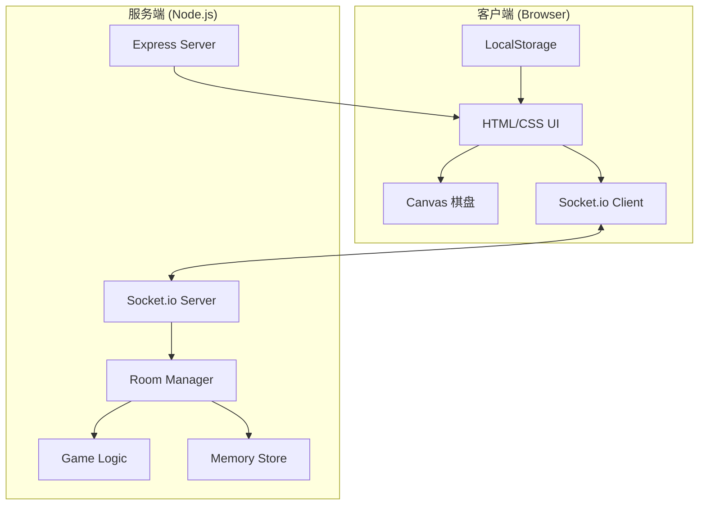

# Design Document

## Overview

本设计文档描述在线多人五子棋（Gomoku Online）的技术架构和实现细节。系统采用前后端分离架构，前端使用纯原生技术（HTML5 + CSS3 + Vanilla JavaScript + Canvas），后端使用 Node.js + Express + Socket.io，实现实时多人对战功能。

### 技术栈

- **前端**: HTML5, CSS3, Vanilla JavaScript, Canvas API, Socket.io Client (CDN)
- **后端**: Node.js, Express, Socket.io v4+
- **部署**: Docker, 单容器部署
- **存储**: 内存存储（无持久化数据库）

## Architecture



### 系统架构说明

1. **客户端层**: 单页面应用，所有资源内嵌在 index.html 中
2. **通信层**: Socket.io 双向实时通信
3. **服务层**: Express 提供静态文件，Socket.io 处理游戏逻辑
4. **存储层**: 内存对象存储房间状态

## Components and Interfaces

### 前端组件

#### 1. LobbyView (大厅视图)
```javascript
// 大厅视图管理
const LobbyView = {
    show(),           // 显示大厅
    hide(),           // 隐藏大厅
    updateRoomList(rooms),    // 更新房间列表
    updateOnlineCount(count), // 更新在线人数
    showCreateRoomModal(),    // 显示创建房间弹窗
}
```

#### 2. GameView (游戏视图)
```javascript
// 游戏视图管理
const GameView = {
    show(),           // 显示游戏界面
    hide(),           // 隐藏游戏界面
    updatePlayerInfo(players), // 更新玩家信息
    updateWatchers(watchers),  // 更新观战者列表
    highlightCurrentTurn(turn), // 高亮当前回合
    showResultModal(result),   // 显示结果弹窗
}
```

#### 3. BoardRenderer (棋盘渲染器)
```javascript
// Canvas 棋盘渲染
const BoardRenderer = {
    init(canvas),              // 初始化画布
    render(board),             // 渲染棋盘状态
    drawStone(x, y, color),    // 绘制棋子
    highlightLast(x, y),       // 高亮最后落子
    highlightWinning(stones),  // 高亮获胜棋子
    getIntersection(clientX, clientY), // 获取点击的交点坐标
    resize(),                  // 响应式调整大小
}
```

#### 4. ChatManager (聊天管理器)
```javascript
// 聊天功能管理
const ChatManager = {
    addMessage(message),       // 添加消息到聊天区
    sendMessage(text),         // 发送消息
    convertEmoji(text),        // 转换表情符号
    scrollToBottom(),          // 滚动到底部
}
```

#### 5. SocketManager (Socket 管理器)
```javascript
// Socket.io 连接管理
const SocketManager = {
    connect(),                 // 建立连接
    disconnect(),              // 断开连接
    emit(event, data),         // 发送事件
    on(event, callback),       // 监听事件
    reconnect(),               // 重连逻辑
}
```

### 后端组件

#### 1. RoomManager (房间管理器)
```javascript
// 房间管理
class RoomManager {
    createRoom(name, creatorSocket)  // 创建房间
    joinRoom(roomId, socket, asWatcher) // 加入房间
    leaveRoom(roomId, socket)        // 离开房间
    getRoom(roomId)                  // 获取房间
    getRoomList()                    // 获取房间列表
    cleanupEmptyRooms()              // 清理空房间
}
```

#### 2. GameLogic (游戏逻辑)
```javascript
// 游戏核心逻辑
class GameLogic {
    static isValidMove(board, x, y)           // 验证落子合法性
    static checkWin(board, x, y, color)       // 检查胜利条件
    static getWinningStones(board, x, y, color) // 获取获胜棋子

}
```

### Socket 事件接口

#### 客户端 → 服务端
| 事件名 | 数据 | 描述 |
|--------|------|------|
| `join-lobby` | `{ nickname }` | 加入大厅 |
| `create-room` | `{ name }` | 创建房间 |
| `join-room` | `{ roomId, asWatcher }` | 加入房间 |
| `leave-room` | `{ roomId }` | 离开房间 |
| `place-stone` | `{ roomId, x, y }` | 落子 |
| `request-undo` | `{ roomId }` | 请求悔棋 |
| `respond-undo` | `{ roomId, accept }` | 响应悔棋 |
| `surrender` | `{ roomId }` | 认输 |

| `chat-message` | `{ roomId, message }` | 发送聊天 |
| `quick-match` | `{}` | 快速匹配 |

#### 服务端 → 客户端
| 事件名 | 数据 | 描述 |
|--------|------|------|
| `room-list` | `[Room]` | 房间列表更新 |
| `online-count` | `{ count }` | 在线人数更新 |
| `room-joined` | `{ room, role }` | 成功加入房间 |
| `room-updated` | `{ room }` | 房间状态更新 |
| `stone-placed` | `{ x, y, color }` | 棋子落下 |
| `game-over` | `{ winner, winningStones }` | 游戏结束 |
| `undo-requested` | `{ from }` | 收到悔棋请求 |
| `undo-result` | `{ accepted, board }` | 悔棋结果 |

| `chat-received` | `{ time, nickname, message }` | 收到聊天消息 |
| `player-left` | `{ nickname }` | 玩家离开 |
| `error` | `{ message }` | 错误消息 |

## Data Models

### Room (房间)
```typescript
interface Room {
    id: string;              // 4-6位数字ID
    name: string;            // 房间名称
    board: number[][];       // 15x15棋盘 (0=空, 1=黑, 2=白)
    players: {
        black: Player | null;
        white: Player | null;
    };
    watchers: Player[];      // 观战者列表
    currentTurn: 1 | 2;      // 当前回合 (1=黑, 2=白)
    history: Move[];         // 落子历史
    chat: ChatMessage[];     // 聊天记录
    winner: null | 1 | 2;       // 胜者 (1=黑胜, 2=白胜)
    status: 'waiting' | 'playing' | 'ended'; // 状态
    createdAt: number;       // 创建时间戳
    lastActivity: number;    // 最后活动时间戳
}
```

### Player (玩家)
```typescript
interface Player {
    socketId: string;        // Socket连接ID
    nickname: string;        // 昵称
}
```

### Move (落子记录)
```typescript
interface Move {
    x: number;               // 横坐标 (0-14)
    y: number;               // 纵坐标 (0-14)
    color: 1 | 2;            // 棋子颜色
    timestamp: number;       // 时间戳
}
```

### ChatMessage (聊天消息)
```typescript
interface ChatMessage {
    time: string;            // 格式化时间 "HH:MM"
    nickname: string;        // 发送者昵称
    message: string;         // 消息内容
}
```


## Correctness Properties

*A property is a characteristic or behavior that should hold true across all valid executions of a system-essentially, a formal statement about what the system should do. Properties serve as the bridge between human-readable specifications and machine-verifiable correctness guarantees.*

Based on the prework analysis, the following correctness properties have been identified. Redundant properties have been consolidated.

### Property 1: Nickname Validation

*For any* string input as nickname, if the string is non-empty, contains 1-20 characters, and is not whitespace-only, then the nickname SHALL be accepted and stored; otherwise it SHALL be rejected.

**Validates: Requirements 1.2, 1.4**

### Property 2: Room State Serialization Round-Trip

*For any* valid Room object, serializing to JSON and then deserializing SHALL produce an equivalent Room object with identical board state, players, watchers, history, and chat.

**Validates: Requirements 12.1, 12.2, 12.3, 12.4**

### Property 3: Room ID Uniqueness and Format

*For any* newly created room, the generated Room ID SHALL be a unique 4-6 digit string, and the initial board SHALL be a 15×15 array filled with zeros.

**Validates: Requirements 3.1**

### Property 4: Click-to-Intersection Snapping

*For any* click position (clientX, clientY) on the canvas, the getIntersection function SHALL return the coordinates (x, y) of the nearest grid intersection point where 0 ≤ x, y ≤ 14.

**Validates: Requirements 4.3**

### Property 5: Occupied Position Rejection

*For any* board state and position (x, y) where board[x][y] ≠ 0, attempting to place a stone at (x, y) SHALL be rejected and the board state SHALL remain unchanged.

**Validates: Requirements 5.1**

### Property 6: Turn Enforcement

*For any* game in progress with currentTurn = C, a player holding color ≠ C attempting to place a stone SHALL be rejected and the board state SHALL remain unchanged.

**Validates: Requirements 5.2**

### Property 7: Win Detection Correctness

*For any* board state where a stone is placed at (x, y) with color C, if there exist 5 or more consecutive stones of color C in any of the four directions (horizontal, vertical, diagonal-right, diagonal-left) passing through (x, y), then checkWin SHALL return true and getWinningStones SHALL return the winning stone positions.

**Validates: Requirements 5.3, 5.4**

### Property 8: Post-Game Move Prevention

*For any* room with status = 'ended' or winner ≠ null, attempting to place a stone SHALL be rejected.

**Validates: Requirements 5.5**

### Property 9: Undo Operation Correctness

*For any* game with at least one move in history, accepting an undo request SHALL remove the last move from history, restore the board position to empty, and switch currentTurn to the opposite color.

**Validates: Requirements 6.3**

### Property 10: Surrender Result

*For any* game in progress where player with color C surrenders, the game SHALL end with winner = opposite of C.

**Validates: Requirements 6.5**

### Property 11: Room Join Logic

*For any* room with status = 'waiting' and one empty player slot, a player joining SHALL be assigned the empty slot (White if Black is taken) and status SHALL change to 'playing'.

**Validates: Requirements 3.2**

### Property 12: Full Room Rejection

*For any* room where both black and white player slots are occupied, a player attempting to join as player (not watcher) SHALL be rejected.

**Validates: Requirements 3.4**

### Property 13: Player Leave Cleanup

*For any* room where a player leaves, that player SHALL be removed from the players object or watchers array, and the room participant count SHALL decrease by 1.

**Validates: Requirements 3.5**

### Property 14: Quick Match Behavior

*For any* call to quick match, if a room with status = 'waiting' exists, the player SHALL join that room; otherwise a new room SHALL be created.

**Validates: Requirements 2.6**

### Property 15: Chat Message Format

*For any* chat message sent, the broadcast message SHALL contain a valid timestamp string, the sender's nickname, and the original message content.

**Validates: Requirements 7.2, 8.1**

### Property 16: Emoji Conversion

*For any* message containing defined emoji shortcuts (:) :D :( etc.), the convertEmoji function SHALL replace all shortcuts with their corresponding emoji characters.

**Validates: Requirements 8.3**

### Property 17: Room List Display Completeness

*For any* room in the room list, the displayed information SHALL include Room ID, Room Name, Black Player (or empty indicator), White Player (or empty indicator), Status, and Watcher count.

**Validates: Requirements 2.2**

### Property 18: Watcher Addition

*For any* player joining a room as watcher, the player SHALL be added to the watchers array and the watcher count SHALL increase by 1.

**Validates: Requirements 3.3**

## Error Handling

### 客户端错误处理

| 错误场景 | 处理方式 |
|---------|---------|
| Socket 连接失败 | 显示重连提示，自动尝试重连（最多3次） |
| 房间不存在 | 显示错误提示，返回大厅 |
| 房间已满 | 显示"房间已满"提示 |
| 非法落子 | 显示错误提示，不改变状态 |
| 网络超时 | 显示加载指示器，超时后提示重试 |

### 服务端错误处理

| 错误场景 | 处理方式 |
|---------|---------|
| 无效房间ID | 返回 error 事件，消息"房间不存在" |
| 无效落子坐标 | 返回 error 事件，消息"无效的落子位置" |
| 非玩家落子 | 返回 error 事件，消息"您是观战者，无法落子" |
| 非当前回合落子 | 返回 error 事件，消息"不是您的回合" |
| 游戏已结束 | 返回 error 事件，消息"游戏已结束" |
| 未知错误 | 记录日志，返回通用错误消息 |

### 错误消息格式

```typescript
interface ErrorEvent {
    code: string;      // 错误代码
    message: string;   // 用户友好的错误消息
}
```

## Testing Strategy

### 测试框架选择

- **单元测试**: Jest
- **属性测试**: fast-check (JavaScript Property-Based Testing Library)
- **测试运行**: `npm test` (使用 Jest --run 模式)

### 单元测试覆盖

1. **GameLogic 模块**
   - `isValidMove`: 测试各种有效/无效落子场景
   - `checkWin`: 测试四个方向的胜利检测
   - `getWinningStones`: 测试获胜棋子位置返回


2. **RoomManager 模块**
   - `createRoom`: 测试房间创建和ID生成
   - `joinRoom`: 测试加入逻辑（玩家/观战者）
   - `leaveRoom`: 测试离开和清理逻辑

3. **工具函数**
   - `getIntersection`: 测试坐标转换
   - `convertEmoji`: 测试表情转换
   - `validateNickname`: 测试昵称验证

### 属性测试策略

属性测试将使用 fast-check 库，配置每个测试运行至少 100 次迭代。

每个属性测试必须：
1. 使用注释标注对应的正确性属性编号
2. 使用格式: `**Feature: gomoku-online, Property {number}: {property_text}**`
3. 引用对应的需求条款

**关键属性测试**:

1. **序列化往返测试** (Property 2)
   - 生成随机有效的 Room 对象
   - 序列化为 JSON，再反序列化
   - 验证结果与原对象等价

2. **胜利检测测试** (Property 7)
   - 生成包含获胜配置的随机棋盘
   - 验证 checkWin 正确识别胜利
   - 验证 getWinningStones 返回正确位置

3. **落子验证测试** (Properties 5, 6, 9)
   - 生成随机游戏状态
   - 测试各种非法落子被正确拒绝

4. **悔棋操作测试** (Property 10)
   - 生成有历史记录的随机游戏状态
   - 执行悔棋操作
   - 验证棋盘和回合正确回退

5. **房间加入逻辑测试** (Properties 13, 14, 16, 20)
   - 生成各种房间状态
   - 测试加入逻辑的正确性

### 测试文件结构

```
tests/
├── unit/
│   ├── gameLogic.test.js
│   ├── roomManager.test.js
│   └── utils.test.js
└── property/
    ├── serialization.property.test.js
    ├── winDetection.property.test.js
    ├── moveValidation.property.test.js
    ├── undoOperation.property.test.js
    └── roomLogic.property.test.js
```

### 测试命令

```bash
# 运行所有测试
npm test

# 运行单元测试
npm run test:unit

# 运行属性测试
npm run test:property
```
