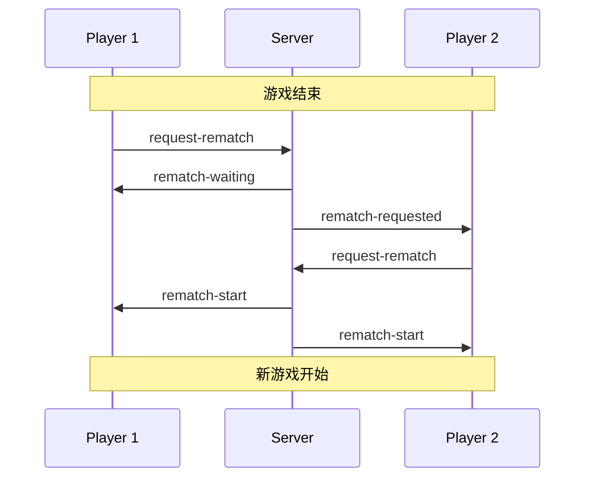
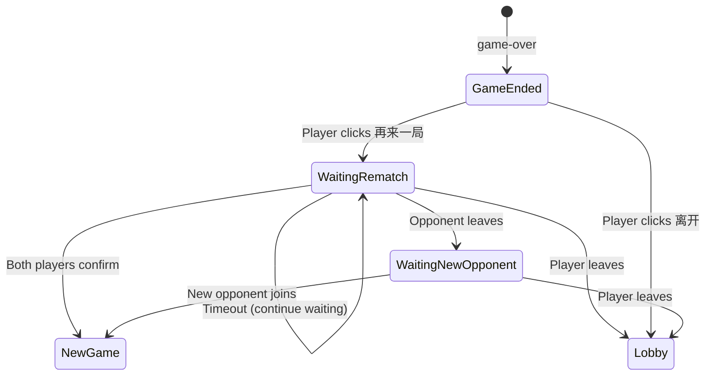

# Design Document: Rematch Optimization

## Overview

本设计文档描述了五子棋游戏中"再来一局"功能和大厅弹窗交互的优化方案。核心改进是将单方重置机制改为双方确认机制，并优化弹窗交互体验。

## Architecture

### 系统架构



### 状态机



## Components and Interfaces

### 1. RematchManager (服务端新增)

负责管理再来一局请求的状态和逻辑。

```javascript
// 再来一局请求状态
interface RematchState {
  requests: {
    black: boolean;
    white: boolean;
  };
  timeout: NodeJS.Timeout | null;
  startTime: number | null;
}

// RematchManager 方法
class RematchManager {
  // 记录玩家的再来一局请求
  requestRematch(roomId: string, socketId: string): RematchResult;
  
  // 取消再来一局请求（玩家离开时）
  cancelRematch(roomId: string, socketId: string): void;
  
  // 检查是否双方都已请求
  checkBothReady(roomId: string): boolean;
  
  // 执行再来一局（重置房间，交换颜色）
  executeRematch(roomId: string): void;
  
  // 清理超时计时器
  clearTimeout(roomId: string): void;
}
```

### 2. Socket Events (更新)

#### 客户端 -> 服务端

| 事件名 | 参数 | 描述 |
|--------|------|------|
| `request-rematch` | `{ roomId }` | 请求再来一局 |
| `cancel-rematch` | `{ roomId }` | 取消再来一局请求 |
| `leave-room` | `{ roomId }` | 离开房间 |

#### 服务端 -> 客户端

| 事件名 | 参数 | 描述 |
|--------|------|------|
| `rematch-waiting` | `{ timeout }` | 等待对方确认 |
| `rematch-requested` | `{ from }` | 对方请求再来一局 |
| `rematch-start` | `{ swapped }` | 双方确认，开始新游戏 |
| `rematch-timeout` | `{}` | 等待超时 |
| `opponent-left-rematch` | `{ canWaitNewOpponent }` | 对方在等待期间离开 |
| `rematch-cancelled` | `{}` | 再来一局请求被取消 |

### 3. 前端状态管理 (更新)

```javascript
// 新增状态
const state = {
  // ... 现有状态
  rematchState: {
    myRequest: false,      // 我是否已请求再来一局
    opponentRequest: false, // 对方是否已请求
    waiting: false,        // 是否在等待状态
    timeoutId: null        // 超时计时器
  }
};
```

### 4. Modal 更新逻辑

游戏结束弹窗需要支持动态更新：

```javascript
// 弹窗状态
interface GameOverModalState {
  winner: 'black' | 'white';
  myRematchRequested: boolean;
  opponentRematchRequested: boolean;
  opponentLeft: boolean;
}

// 按钮状态
- 初始: "再来一局" (可点击)
- 我已请求: "等待对方..." (禁用)
- 对方已请求: "再来一局 ✓" (高亮)
- 对方离开: "等待新对手" / "离开"
```

## Data Models

### Room 扩展

```javascript
// 在现有 Room 对象中添加
interface Room {
  // ... 现有字段
  rematchState: {
    requests: {
      black: boolean;
      white: boolean;
    };
    timeoutStarted: number | null;
  };
}
```

### 事件数据结构

```javascript
// rematch-waiting 事件
{
  timeout: 30000,  // 超时时间（毫秒）
  opponentRequested: false  // 对方是否已请求
}

// rematch-start 事件
{
  swapped: true,  // 是否交换了颜色
  newRole: 'white'  // 我的新角色
}

// opponent-left-rematch 事件
{
  canWaitNewOpponent: true,  // 是否可以等待新对手
  roomStatus: 'waiting'  // 房间当前状态
}
```

## Correctness Properties

*A property is a characteristic or behavior that should hold true across all valid executions of a system-essentially, a formal statement about what the system should do. Properties serve as the bridge between human-readable specifications and machine-verifiable correctness guarantees.*

### Property 1: Rematch Request Recording

*For any* player who clicks "再来一局", the room's rematch state SHALL contain that player's request as true, and the opponent SHALL receive a notification event.

**Validates: Requirements 1.1**

### Property 2: Both Players Rematch Triggers Reset

*For any* room where both players have requested rematch, the game board SHALL be reset to empty, both players SHALL remain in the room, and the room status SHALL be "playing".

**Validates: Requirements 1.2, 1.4**

### Property 3: Single Player Rematch Shows Waiting

*For any* room where only one player has requested rematch, that player's rematch state SHALL show "waiting" status, and the room SHALL NOT reset.

**Validates: Requirements 1.3**

### Property 4: Color Swap After Rematch

*For any* rematch where there was a winner in the previous game, the previous winner SHALL become the white player (second to move) in the new game.

**Validates: Requirements 1.5**

### Property 5: Rematch Timeout Notification

*For any* rematch request that has been pending for more than 30 seconds, the requesting player SHALL receive a timeout notification.

**Validates: Requirements 2.1**

### Property 6: Disconnect During Rematch Notification

*For any* player waiting for rematch confirmation, if the opponent disconnects, the waiting player SHALL receive a notification with options to wait for new opponent or leave.

**Validates: Requirements 2.3**

### Property 7: Leave Removes Player

*For any* player who clicks "离开" after game over, that player SHALL be removed from the room and returned to the lobby state.

**Validates: Requirements 3.1**

### Property 8: Leave During Rematch Updates Room

*For any* player who leaves during rematch waiting, the remaining player SHALL receive a notification, and the room status SHALL become "waiting".

**Validates: Requirements 3.2, 3.3**

### Property 9: State Broadcast Consistency

*For any* rematch-related state change, all participants in the room SHALL receive the same state update simultaneously.

**Validates: Requirements 6.1, 6.2, 6.3**

## Error Handling

### 网络断开

1. 玩家断开连接时，自动取消其再来一局请求
2. 通知对方玩家断开状态
3. 房间状态重置为等待新玩家

### 超时处理

1. 30秒超时后发送通知，但不强制结束等待
2. 玩家可选择继续等待或离开
3. 超时计时器在对方响应或离开时清除

### 并发请求

1. 使用服务端状态作为唯一真相来源
2. 客户端状态仅用于UI显示
3. 所有状态变更通过服务端广播同步

## Testing Strategy

### 单元测试

1. RematchManager 的各个方法
2. 状态转换逻辑
3. 超时计时器管理

### 属性测试

使用 fast-check 进行属性测试，每个属性测试至少运行 100 次迭代。

测试标签格式: **Feature: rematch-optimization, Property {number}: {property_text}**

### 集成测试

1. 完整的再来一局流程
2. 断开重连场景
3. 多种离开场景

### 测试框架

- 单元测试: Jest
- 属性测试: fast-check
- 集成测试: Jest + Socket.IO mock
