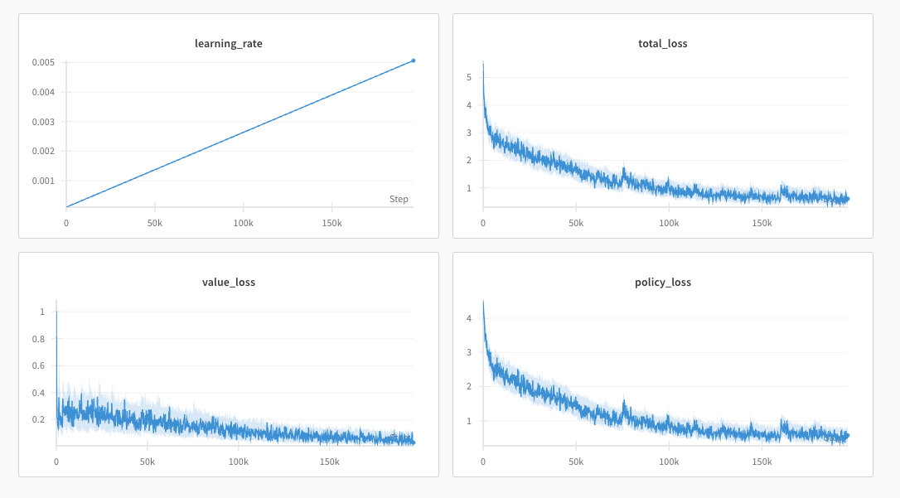
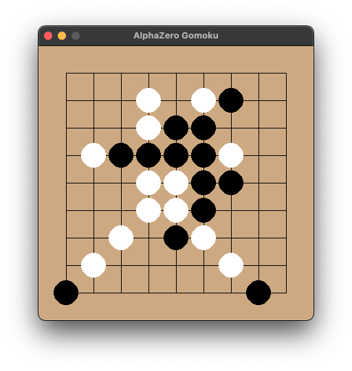

# AlphaZero Gomoku

An implementation of the AlphaZero algorithm for the game of Gomoku (Five in a Row), featuring self-play reinforcement learning and Monte Carlo Tree Search.

Training Loss Curve over 22 Iterations, last for 4 days on a single RTX 3090 Ti:


> MCTS simulations=2000, cpuct=4.0

TODOs:
- [ ] Refactor this project and improve code quality to serve as nano alphazero
- [ ] ...

## Key Features
- Complete AlphaZero algorithm implementation with MCTS and policy-value network
- Self-play training with experience replay buffer
- 1cycle learning rate scheduling for stable training
- Arena evaluation mechanism for model selection
- Support for different board sizes (9x9, 15x15)

## Installation

```bash
pip install torch numpy tqdm wandb pygame
```
You can download the best pre-trained model so far from [my huggingface repo](https://huggingface.co/Nagi-ovo/alphazero-gomoku) and put it in the `temp` folder.
## Usage

### Play Against Trained Model
```bash
python alphazero.py --play \
    --round=2 \
    --player1=human \
    --player2=alphazero \
    --ckpt_file=best.pth.tar \
    --verbose
```



### Train from Scratch
```bash
python alphazero.py --train --wandb
```

### Key Parameters
- `numMCTSSims`: Number of MCTS simulations per move (default: 400)
- `numEps`: Number of self-play games per iteration (default: 100)
- `maxlenOfQueue`: Size of replay buffer (default: 200000)
- `cpuct`: Exploration constant in MCTS (default: 1.0)
- `min_lr`/`max_lr`: Learning rate bounds for 1cycle schedule (1e-4 to 1e-2)
- `board_size`: Board size, directly affects model size & training speed (default: 9)

## Project Structure
- `alphazero.py`: Main implementation including MCTS and neural network
- `game.py`: Gomoku game logic & rules, including board state rendering, move generation, and game end detection

## Blog & Tutorial

[alphazero-from-scratch](https://blog.nagi.fun/alphazero)

## Acknowledgments
This project is inspired by and has greatly benefited from the work of [schinger/AlphaZero](https://github.com/schinger/AlphaZero).

